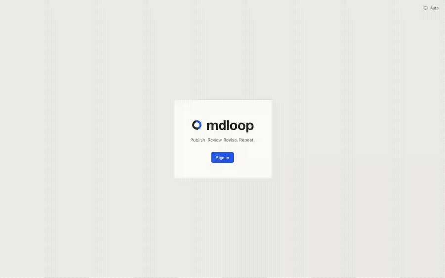
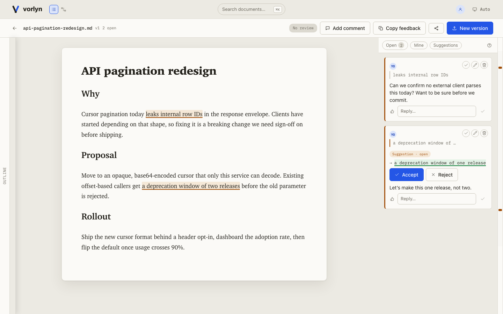

<p align="center">
  <picture>
    <source media="(prefers-color-scheme: dark)" srcset="docs/assets/vorlyn-mark-dark.svg">
    
  </picture>
</p>
<h1 align="center">Vorlyn</h1>
<p align="center"><strong>The review loop for agent-written docs.</strong></p>

<p align="center">
  
  
  
</p>

> Beta (`0.1.0-beta.*`) — covers the local, single-user path below. Team/self-hosting still means
> building from source. [`docs/STATUS.md`](docs/STATUS.md) tracks exactly what exists today and
> what is deliberately absent.

## Why this exists

Agents write the first draft of specs, PRDs, and runbooks. A human still has to read it, mark it
up, and sign off — but today that happens in a chat thread the file never sees, or in a code-diff
tool built for code, not prose.

Vorlyn is that missing loop: the agent publishes, a human reviews and comments right on the doc,
the agent reads the feedback back and revises. Repeat until it's signed off.



## What you get

- **Comments track the sentence, not the line number.** Re-anchoring uses a confidence score — a
  comment shows as **orphaned** instead of silently jumping to the wrong spot.
- **Built for reading prose, not diffing code.** Inline comments, suggested edits, sign-off.
- **Your agent is in the loop, not stuck outside it.** MCP tools cover publish, poll, read
  feedback, and revise — no human relaying messages by hand.
- **Nothing is ever overwritten.** Every upload is a new immutable version; old ones stay visible
  so no comment loses its context.
- **Your data, exportable anytime.** Full version history and comments as plain JSON. Apache-2.0,
  your own Postgres, no hosted account required.

## Two ways to run it

### Just you, on your laptop

```sh
npx vorlyn@beta open ./my-project
```

Spins up an embedded Postgres (PGlite — a real Postgres wire-protocol socket server), mints you an
admin key, opens the app in your browser, and links the folder. `vorlyn serve start` runs the same
thing detached, so it survives closing the terminal.

> It's `@beta`, not `@latest`, for now — pin it explicitly. `npx vorlyn` alone won't resolve until
> a `latest` tag exists.

<p align="center"></p>

### Your team or company

- **SSO against your existing directory** — `VORLYN_AUTH_MODE=oidc` does real browser login against
  Keycloak, Authentik, Dex, Google, Okta, or any other OIDC-compliant provider via discovery (Entra
  ID included). The first person to sign in becomes the bootstrap admin.
- **Share a document with the people who need it** — named teammates at
  `read | comment | share | edit`, org-admin project-wide grants, and time-limited invites for
  external guests, capped at read/comment by the schema itself.
- **Runs on your infrastructure** — one container from the provided `Dockerfile`, your own Postgres
  ≥14, local disk or any S3-compatible store (S3, MinIO, R2, B2). MCP is a second container, so
  agents get the same engine.
- **Isolation is the database's job** — every tenant table carries Postgres row-level security and
  composite `(id, org_id)` FKs, and the app connects as a non-superuser role that structurally
  cannot skip RLS. Proven against a real Postgres in CI, never a mock.

Full walkthrough (Docker, database, config, first login): [`SELF_HOSTING.md`](SELF_HOSTING.md).

## Connect your coding agent

- **Endpoint** — `vorlyn serve status` prints it; default `http://127.0.0.1:58744/mcp`.
- **Key** — `.vorlyn/credentials` in a linked folder (`{"apiKey": "vorlyn_..."}`), or mint one in
  the web app. Sent as `Authorization: Bearer vorlyn_...`.

**Claude Code** — the plugin drives the whole publish/review/revise loop on its own, MCP included:

```sh
claude plugin marketplace add /path/to/vorlyn
# then, inside Claude Code:
/plugin install vorlyn-sync@vorlyn
```

For a local instance, that's it — a `SessionStart` hook starts the server, links the folder, and
registers the MCP connection with Claude Code itself, so the tools are just there. Only a shared
team instance needs the manual form below (its MCP URL isn't something the plugin can discover on
its own):

```sh
claude mcp add --transport http vorlyn http://127.0.0.1:58744/mcp \
  --header "Authorization: Bearer vorlyn_..."
```

**Cursor** — `.cursor/mcp.json`:

```json
{
  "mcpServers": {
    "vorlyn": {
      "url": "http://127.0.0.1:58744/mcp",
      "headers": { "Authorization": "Bearer vorlyn_..." }
    }
  }
}
```

**Codex CLI** — `~/.codex/config.toml`:

```toml
[mcp_servers.vorlyn]
url = "http://127.0.0.1:58744/mcp"
bearer_token_env_var = "VORLYN_API_KEY"
```

**Anything else** — any MCP client speaking streamable HTTP: same URL, same header.

Then just ask it — _"push this spec to Vorlyn for review"_ … _"what did the reviewer say?"_ The
second question calls `get_feedback_bundle`, which returns "everything a human said that you still
have to act on … plus the whole set rendered as one prompt-ready text block."

<details>
<summary>All 20 MCP tools</summary>

| Stage                    | Tools                                                                                                                                         |
| ------------------------ | --------------------------------------------------------------------------------------------------------------------------------------------- |
| **Publish**              | `upload_document`, `request_review`                                                                                                           |
| **Check on review**      | `get_review_status`, `submit_review`                                                                                                          |
| **Read feedback**        | `get_feedback_bundle`, `list_versions`, `get_diff`                                                                                            |
| **Respond**              | `create_comment` (suggestions too), `reply_to_comment`, `resolve_comment`, `accept_suggestion`, `reject_suggestion`                           |
| **Find your way around** | `list_projects`, `create_project`, `list_documents`, `get_document`, `get_document_status`, `search_documents`, `get_org_usage`, `export_org` |

Full reference, generated from the server source so it can't drift:
[`docs/reference/mcp-reference.md`](docs/reference/mcp-reference.md).

</details>

## Under the hood

- [`docs/ARCHITECTURE.md`](docs/ARCHITECTURE.md) — diagram, data model, extension seams
- [`docs/STATUS.md`](docs/STATUS.md) — what exists, and what is deliberately absent
- [`CONSTITUTION.md`](CONSTITUTION.md) — the non-negotiables; changing one needs an ADR
- [`docs/adr/`](docs/adr/) — a real decision log, not marketing copy

## Contributing

```sh
pnpm install
make dev      # API :3000 + web :5173 + MCP :3001, loopback auth — "Sign in" just signs you in
make verify   # the full merge gate: lint, format, types, boundaries, tests, coverage floors
```

[`CONTRIBUTING.md`](CONTRIBUTING.md) has the full workflow.

## License

Apache-2.0 ([LICENSE](LICENSE), [NOTICE](NOTICE)). The license conveys the code, not the right to
call a hosted or distributed derivative "Vorlyn" — see NOTICE.
