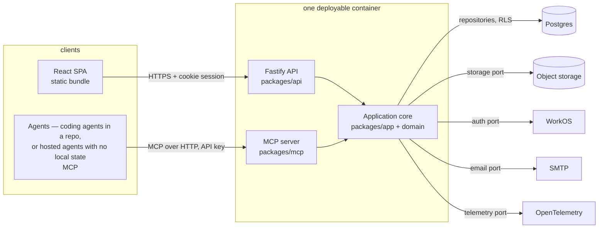
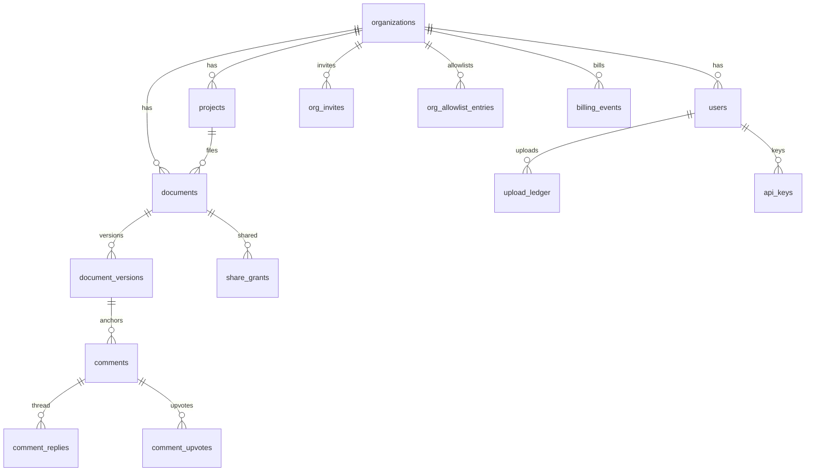

# mdloop — Architecture

Companion to [CONSTITUTION.md](../CONSTITUTION.md). Constitution wins on conflict.

## 1. System overview



One deployable container image runs both transports (API + MCP) against the same application core. No server-side session state (sessions validated per request), so horizontal scale is a deployment's own choice of how many instances to run.

This core ships a Dockerfile and a compose file, not a specific cloud's infrastructure (CONSTITUTION §7) — a deployment brings its own; see `SELF_HOSTING.md`. `make dev` starts API :3000 + web :5173 + MCP :3001 against a persistent local Postgres (`mdloop_dev`), a loopback `AuthPort` stub, a filesystem `StoragePort` adapter, and a logging `EmailPort` adapter. No Docker required for this path, no LocalStack.

`AuthPort` has three real adapters, not just the WorkOS one shown above: hosted WorkOS AuthKit
(CONSTITUTION §2's pick — email OTP/magic link/MFA and enterprise SAML/SCIM with the least auth
code to own), plus two self-host-only modes with no WorkOS dependency at all —
`MDLOOP_AUTH_MODE=single-user` (one fixed admin identity, no login screen) and `=oidc` (real
browser login against any OIDC-compliant provider via discovery: Keycloak, Authentik, Dex, Google,
Okta, …). `packages/api/src/selfhost-main.ts` defaults to `single-user`; see `SELF_HOSTING.md`.

## 2. Monorepo layout

```
packages/
  domain/        # entities, value objects, anchor logic, tier/quota/retention policies — zero framework deps
  app/           # use-cases; ports: StoragePort, AuthPort, SeatSyncPort, EmailPort, TelemetryPort, ClockPort, IdPort
  persistence/   # Postgres repositories + migrations (0001–0033); sets tenant context per call
  api/           # Fastify routes/schemas -> use-cases; cookie auth; rate limits; dev-main loopback entry
  mcp/           # MCP tools -> same use-cases; API-key auth mapped to user+org
  jobs/          # compliance sweep scheduler (Phase 24.D) — version purge, retention, erasure
                 # replay, anchor-cache prune; standalone long-running process
  cli/           # `mdloop` CLI — link/unlink/push/status/watch (repo <-> document sync),
                 # open/serve (zero-install self-host), projects (folder->project mapping)
  web/           # React SPA
  shared/        # DTO types shared web/api/mcp
features/        # Gherkin money paths (quota, retention, permissions, isolation, guest sharing, org usage)
e2e/             # Playwright against the dev stack
docs/adr/        # ADR 0001: version tombstones; ADR 0002: handover workflow (sign-off, agent
                 # attribution, suggested edits); ADR 0003: rendered leg diff + review signals;
                 # ADR 0004: public docs hub; ADR 0005: test-infra + session/CSRF policy;
                 # ADR 0006: zero-downtime deploys + expand/contract migrations;
                 # ADR 0007: deferred suggestion materialization;
                 # ADR 0008: grantable edit rights;
                 # ADR 0010: rate-limiter test infrastructure; ADR 0011: upload content
                 # validation + size cap;
                 # ADR 0013: MCP OAuth protected resource; ADR 0014: share permission rung
                 # + project-level grants
```

Dependency rule (CI-enforced via dependency-cruiser): `web|api|mcp → app → domain`; `persistence` implements `app` ports; nothing imports upward.

**Read/write seam (CQRS-lite, deliberate).** Simple reads (`GET /projects`, `GET /documents`, etc.) call a repository port directly from the route handler — there's no use-case for "list the things I already have permission to see," just a query. Every mutation and every read with actual business logic (permission resolution, quota checks, anchor re-resolution, derived status) goes through a use-case in `packages/app`. This was true from early phases but undocumented until the Phase 24 architecture review named it; it's a legal, intentional pattern under the dependency rule above (routes may call `app`'s port interfaces either way), not an escape hatch from it — the boundary that actually matters (`web|api|mcp → app → domain`, no business logic in route handlers) is unchanged either way, since a plain `list()` call has no business logic to place.

## 3. Tenant isolation (Core Principle 1)

Defense in depth:

1. **Postgres RLS** — every tenant-scoped table carries `org_id`; policy `USING (org_id = current_setting('app.org_id')::uuid)`. App connects as `mdloop_app` (non-superuser, `NOBYPASSRLS`). Policies are `FORCE ROW LEVEL SECURITY`.
2. **Composite FKs** — foreign keys between tenant tables are composite `(id, org_id)`. FK checks bypass RLS; plain FKs would leak existence across orgs, composite ones structurally can't.
3. **Repository layer** — every repository method requires a `TenantContext` argument (no default, not injectable globally). Each transaction begins `SET LOCAL app.org_id = $1`. Connection pool resets the setting on release. `withTenant()` is the only query path.
4. **Use-case guards** — permission checks (owner/admin/share grants/guest allowlist) on top; RLS is the backstop, not the only check.
5. **`mdloop_login` role + startup assertion** (Phase 24.E, migration 0024) — the app's _connecting_ login role is a committed, dedicated `mdloop_login` (`NOSUPERUSER NOBYPASSRLS NOINHERIT`), not whatever role a deployment's `DATABASE_URL` happened to point at. It reaches `mdloop_app`/`mdloop_provisioner`/`mdloop_public_reader` only via an explicit `SET LOCAL ROLE` in `withTenant`/`withProvisioner`/`withPublicReader` — never by passive inheritance. Every prod entrypoint (`api`, `mcp`, `jobs`) runs `assertNonSuperuserRole` at startup and refuses to serve if the connection turns out to be a superuser — CONSTITUTION §4's "the application connects as a non-superuser role that cannot skip RLS" is now enforced at both the schema level (the role's own attributes) and the runtime level (a boot-time check), not just a deployment convention.

Blob storage inherits this: storage keys are always derived from a typed `VersionKey{orgId, documentId, seq}` fed by tenant context — no function accepts a raw storage key/path from outside.

Tested per phase: org A vs org B via HTTP API, MCP tool, and direct repository call, against an ephemeral per-run Postgres database (`createTestDb` in `@mdloop/persistence/test-support`).

## 4. Data model



Key columns (all tenant tables have `org_id uuid not null` + RLS):

- `organizations`: id, name, sharing_mode (`link` | `directory`), retention_days, purge_immediately, tier (`free` | `team` | `enterprise`), version_retention jsonb, subscription_status, billing_customer_id, trial_ends_at, read_only_at, purge_scheduled_at, idle_warning_sent_at, last_activity_at, external_sharing bool (enterprise defaults off), provisioning_mode (`open` | `allowlist`), sso_connection_id (WorkOS Organization id, keys SSO JIT), session_max_hours (nullable, 1–24, org ceiling tighter than the 24h global default — Phase 24.C, ADR 0005)
- `users`: id, org_id, workos_user_id, email, display_name, role (`admin` | `member` | `guest`), created_at. Guests are ordinary rows with a synthetic `workos_user_id` (`guest:<uuid>`) — no parallel identity system.
- `projects`: id, org_id, name, color (fixed palette), created_at, archived_at, created_by (nullable, composite FK to `users(id, org_id)` — Phase 24.B; a null `created_by` predates migration 0021 and is deliberately treated as admin-only by `canManageProject`, never trusted to a guessed owner)
- `documents`: id, org_id, project_id nullable (null = unfiled), owner_id, title, current_version_id, archived_at, deleted_at (soft delete), purge_after (deleted_at + retention)
- `document_versions`: id, org_id, document_id, seq int, s3_key, content_hash (sha256), byte_size, created_by, source (`web` | `mcp`), created_at, purged_at. Immutable content — no UPDATE path; retention purge sets `purged_at` and drops the blob, the row stays as a visible tombstone (ADR 0001).
- `comments`: id, org_id, document_id, version_id (pinned), author_id, body (≤ 2000 chars, DB-checked), anchor jsonb, status (`open` | `resolved`), resolved_by/at, deleted_at (soft delete), created_at
- `comment_replies`: id, org_id, comment_id, author_id, parent_reply_id nullable (composite self-FK; nesting capped at depth 5 in domain `replyDepth`), body, created_at
- `comment_upvotes`: comment_id, user_id, org_id — one row per (comment, user)
- `share_grants`: id, org_id, subject_type (`document` | `project` — the `project` arm went live with ADR 0014; unused before that despite being allowed by the schema since migration 0001), subject_id, grantee_type (`link` | `user`), grantee_user_id nullable, grantee_email nullable (guest shares), permission (`read` | `comment` | `share` | `edit` — ADR 0008, ADR 0014; a second check constraint, `share_grants_guest_read_comment_only`, forbids anything but `read`/`comment` whenever `grantee_email` is set, so a guest grant can never carry `share` or `edit`), token_hash nullable, expires_at nullable (guest expiry, enforced at read time — no sweep), created_by, revoked_at
- `api_keys`: id, org_id, user_id, key_hash, created_at, revoked_at — every MCP call executes as the owning user
- `org_invites`: id, org_id, email, role, token_hash (single-use), expires_at (7 days), accepted_at, revoked_at
- `org_allowlist_entries`: id, org_id, email — SSO JIT gate when provisioning_mode = `allowlist`
- `upload_ledger`: id, org_id, user_id, version_id, byte_size, created_at — quota source of truth (rolling-window counts)
- `billing_events`: inert schema residue from `0006_billing.sql` (provider event log shape) — nothing in this repository writes to it; kept because migrations are forward-only and never renumbered (ADR 0006), same reasoning as `organizations.subscription_status`/`billing_customer_id` below
- `erasure_log`: compliance record of purges/erasures — opaque ids only
- `search_index`: tsvector over title + version content, maintained on upload; queries always join through the permission check

Blob layout: `orgs/{org_id}/docs/{document_id}/v{seq}` — derived from `VersionKey`, org prefix enables lifecycle rules and per-org purge/export. Real deployment: a private S3-compatible bucket; local/self-host: filesystem adapter behind the same `StoragePort`. Uploads and downloads both stream through the API today (500KB cap, ADR 0011, makes proxying trivial — hash + validate + count quota atomically) rather than via short-lived presigned URLs — `BlobUrlPort` and its two adapters exist for that path but have no production caller yet (CONSTITUTION §4 names presigned URLs as the target; `docs/RISKS.md` tracks the gap).

## 5. Anchor model (Core Principle 2)

Comment `anchor` JSONB, discriminated on `type`:

```jsonc
// text selection
{ "type": "text", "exact": "...", "prefix": "≤32ch", "suffix": "≤32ch", "start": 1042, "end": 1103 }
// diagram part (mermaid)
{ "type": "diagram", "blockIndex": 2, "kind": "node|edge|actor|message",
  "stableId": "B" /* or "A->B", "API", {"index":1,"text":"..."} */ }
// whole document
{ "type": "document" }
```

Re-anchoring pipeline: exact quote match → context disambiguation (duplicate quotes) → diff offset mapping + similarity → bitap fuzzy search → orphan. Confidence < 0.6 ⇒ honestly orphaned (never silently re-pinned), shown in the orphan lane. Re-anchor computed lazily per (comment, version) pair and cached in `comment_anchor_resolutions` so viewing an old version still highlights correctly.

Diagram anchors: mermaid renders source names into DOM ids (`flowchart-B-3`, `L_A_B_0`); stableId survives diagram edits; node/edge deleted from source ⇒ orphan. After each version upload, the viewer's triage panel lists every open comment whose anchor orphaned or moved with reduced confidence, with one-click resolve.

## 6. Versioning & diff

- Upload with same document id ⇒ `seq+1`, new blob; `current_version_id` moves. Identical content_hash ⇒ no-op (idempotent agent re-push).
- Viewer defaults to current version; comments from older versions re-anchor forward with a confidence badge. Versions surface as "Legs" in the UI (display rename only).
- Purged versions stay visible as inert tombstones in the version strip (ADR 0001) — history never silently shortens.
- Diff view: server returns both version texts; client renders a unified diff ("what changed since my comment" = diff from comment.version_id to current). Content routes carry ETags.

## 7. Sharing, joining, and permissions

- Org toggle `sharing_mode`: `link` (anyone in org with link; grant row created on first open) or `directory` (explicit user grants).
- Permission lattice: `read` < `comment` < `share` < `edit` (ADR 0008, ADR 0014). `share` = **create/revoke grants on the document, and nothing else**, gated by `canShareDocument`; `edit` = **upload new versions**, gated by `canEditDocument`, and inherits `share` by true lattice inheritance (`permits('edit', 'share') === true`) so an `edit` grantee can also re-share. Both held by the owner or any org admin unconditionally; `share`/`edit` grantees hold exactly the rung named on their grant. Delegation is capped at the granter's own held level (`canDelegate`) — a `share` holder may mint `read`/`comment`/`share` but never `edit`; an `edit` holder may mint any of the four. Revocation: owner/admin may revoke any grant; a `share`/`edit` holder may revoke only a grant they themselves created.
- Document _management_ is not on the lattice: delete/archive/move, resolve, review requests and suggestion accept/reject are owner-or-org-admin via `canManageDocument`, unaffected by either `share` or `edit`. Re-sharing moved off this list with ADR 0014 — it is now `canShareDocument` (owner/admin, or a `share`-or-above grantee), a third predicate deliberately kept apart from both `canManageDocument` and `canEditDocument` so a new capability got a new gate rather than widening an existing one.
- `share`/`edit` are grantable on **named user grants only**, never on a share link (a link is forwardable; policy call, ADR 0008 decision 4, ADR 0014) and never to an external guest (structural — DB check `share_grants_guest_read_comment_only` + grant-creation refusal + `canEditDocument`/`canShareDocument`'s guest branch). Both caps are explicit allowlists (`GuestGrantablePermission`/`LinkGrantablePermission` = `'read' | 'comment'`), not a denylist on `edit` — a denylist would have silently admitted `share` the moment the lattice grew (ADR 0014).
- **Project-level grants** (ADR 0014): a `share_grants` row may target a project instead of a document (`GrantSubject` `{type:'project'}`, allowed by the schema since migration 0001 but not wired until now). A project grant confers its permission on every document _currently_ in that project, resolved live alongside any grant on the document itself (`documentPermissionFor`, highest wins) — moving a document out drops that access immediately, moving one in picks it up immediately, no snapshot. Org-admin-only to create/list/revoke (deliberately narrower than document sharing, closing an escalation path where a member could plant a project and wait for someone else's document to land in it); named-user grants only, never a link or a guest.
- Resolve rights: document owner and org admin. Everyone with `comment` can create/reply/upvote.
- Share links: token shown once, `token_hash` stored; redeeming requires an authenticated session in the same org — links never cross the org boundary.
- **External guests** (Phase 18): a share to an outside email mints a guest `users` row behind an ordinary expiring `share_grants` row (`grantee_email`, `expires_at`). Tier ceilings: max active guests 3/25/∞ and max share days 7/30/∞ (days clamp, never error). `organizations.external_sharing` off blocks both create and redeem. Re-sharing to the same email extends expiry and reissues the token. Expiry enforced at read time. Guests hit an API allowlist preHandler (review surface only), are excluded from seat counts, and get viewer-only web chrome via `/g/:token` redemption minting a capped session.
- **Joining an org** (Phase 15): both paths decide inside `signIn()` — manual invites (admin sends email+role; hashed single-use token, 7-day expiry, via `EmailPort.sendOrgInvite`) and enterprise SSO JIT (keyed off `sso_connection_id`; `provisioning_mode` `open` or `allowlist`). Seat ceiling = tier `maxCollaborators`. Fallback: personal-org bootstrap.

## 8. Tiers & quotas

- Domain-layer tier policy (`free` | `team` | `enterprise`): collaborator seats, external-guest ceilings, version-retention windows, upload quotas. Gherkin-specified in `features/`. The lattice is real and enforced in code — SSO/JIT provisioning, for instance, is `tier === 'enterprise'` at login — but attaching money to a tier is the consuming deployment's job (CONSTITUTION §7); a self-hosted org's ceilings are simply unlimited, so the machinery is inert rather than crippling.
- Upload fair use: max 500KB/file, content-policy validated on ingest (ADR 0011); per-user rolling quotas (default 100/week, 300/month) counted from `upload_ledger` inside the upload transaction. HTTP 429 with `Retry-After`; MCP returns the identical typed error.
- No billing provider, no subscription lifecycle, no `BillingProviderPort` anywhere in this repository (CONSTITUTION §7) — not a port, not a stub, not a null object, the concept simply does not appear. Where the core genuinely needs to state a fact a deployment may act on, it states the bare fact through `SeatSyncPort.onSeatsChanged(org, humanMemberCount)`, defaulting to `NoopSeatSync`: no billable seats, no customers, no subscriptions appear in it, and a self-hoster configures nothing. `organizations.subscription_status`/`billing_customer_id` (from `0006_billing.sql`) are inert schema residue that nothing reads — migrations are forward-only and never renumbered (ADR 0006), so a column a removed feature once owned outlives the feature.

## 9. MCP surface (parity with API)

20 tools (`packages/mcp/src/server.ts`): `list_projects`, `create_project` (any member; names are not unique — `list_projects` first to reuse rather than duplicate), `get_org_usage` (seats, storage and quota headroom for the caller's org), `list_documents`, `get_document` (content + metadata), `get_document_status` (seq + content hash + your permission, no body — the cheap "has this moved?" pre-flight the sync CLI's conflict guard runs on every push), `list_versions` (version history incl. change notes and tombstone status), `get_diff` (structured block diff between two versions — `diff_too_large`/`version_purged` honesty), `upload_document` (create/new-version, optional `change_note`, response carries a `url` to the document when the deployment has `WEB_APP_URL` configured), `get_feedback_bundle` (all unresolved comments + quoted text + thread + anchor context, prompt-shaped — same bundle as the web "Copy feedback" button), `create_comment` (optional `proposed_text` makes it a suggestion), `accept_suggestion`, `reject_suggestion`, `reply_to_comment`, `resolve_comment`, `export_org` (keyset-paged org export, `cursor`/`limit`, GDPR Art. 20), `request_review` (also carries a `url`, same condition as `upload_document`, and on `mdloop open`/`mdloop serve`'s local instance opens the reviewer's browser there automatically — `MDLOOP_AUTO_OPEN_REVIEW=0` opts out), `get_review_status` (derived status + requests + verdicts + approval gate), `submit_review` (approve/changes-requested verdict), `search_documents` (documents + comments, one call). Auth: per-user API keys (hashed, org-scoped, revocable) — every MCP call executes as that user through identical use-cases, plus a second Bearer-token path (ADR 0013) for interactive clients: an OIDC-provider-issued OAuth access token, verified as a protected resource (RFC 9728) via a provider-generic `OidcJwtVerifier` (signature against the provider's live JWKS, issuer, audience, expiry — nothing WorkOS-specific in the verifier itself), resolving to the same `Actor` shape. Both paths coexist; API keys stay primary for headless/agent use. Wired against WorkOS AuthKit today (CONSTITUTION §2's hosted-auth pick), and the same verifier works against any OIDC provider that publishes a standard JWKS. OAuth is code-complete but inert in every deployed environment until a deployment registers a Resource Indicator with its provider and a domain exists (ADR 0013).

### 9.1 Agent-agnostic publish → review (no repo, no CLI, no local files)

Everything else in this repo — `packages/cli`, `claude-plugin/`, the `mdloop-sync` skill — describes an
agent working inside a checkout, which makes it easy to assume a repo is load-bearing. It is not. **An
agent whose entire state is an API key can drive the full loop over MCP alone**: a support bot drafting a
policy, a planning agent producing a spec, anything with no filesystem to mirror.

```
upload_document (no document_id → creates fresh)
  → request_review
    → [human reviews in the web app]
      → agent polls get_review_status and/or get_feedback_bundle
        → (if changes requested) apply the feedback
          → upload_document (with document_id → appends a version)
            → request_review again  ↺
```

What makes that true today, concretely:

- **Identity comes from the key string and nothing else.** `actorForApiKey` (`packages/app/src/use-cases/api-keys.ts`) resolves a presented key straight to an `Actor{ctx:{orgId,userId}, role, apiKeyId}`. Every MCP transport builds its actor that way per call — there is no session, no device, no local credential file.
- **`UploadSource` has always included `mcp`** (`packages/domain/src/entities.ts`), and the `upload_document` tool hardcodes `source: 'mcp'` on both branches. Nothing about that source is repo-shaped; agent attribution rides `via_api_key_id` on the version row (ADR 0002), not a working directory.
- **`Document.path` is optional display metadata, never required.** `path?: string` on both `UploadNewDocumentInput` and `UploadNewVersionInput` (`packages/app/src/use-cases/upload.ts`); omitting it on a new document leaves `path` null, and omitting it on a new version leaves any stored path untouched. It never reaches storage either — blob keys stay `VersionKey{orgId, documentId, seq}` (§3), so a path-less document is fully addressable.
- **Sign-off keys off `DocumentId` + `UserId` only.** `requestReview`, `getReviewStatus`, `submitReview` and `revokeReviewRequest` (`packages/app/src/use-cases/review.ts`) take a document id and an actor; status is derived from active requests + approvals on the current version. The file contains no notion of a path, manifest, checkout or CLI, and neither does `getFeedbackBundle`.
- **Both routes converge.** A CLI push and an MCP `upload_document` mint the same version row through the same `uploadNewVersion` use-case; the only difference is the `source` label and whether a `path` rode along. There is no CLI-only state a hosted agent would be missing.

Proven, not just asserted: `features/agent-publish-review.feature` walks an agent resolved from an API key
through publish → request review → human verdict → feedback bundle → revision → reply/resolve → approval,
with no filesystem path anywhere in the loop, plus the cross-org isolation case (CONSTITUTION §8.3). This
is a CONSTITUTION §5 parity claim — a capability existing in one transport and not the other is a bug —
so it gets an executable spec like the other money paths.

The agent-side companion is `claude-plugin/skills/mdloop-review/SKILL.md`, which teaches the read half of
this loop and states the same premise from the other direction ("This skill assumes **nothing local
exists**: no repo, no checkout, no `.mdloop/`"). It also carries the one branch that matters here: if the
agent _does_ happen to sit in a repo containing `.mdloop/`, the push step belongs to `mdloop push` so the
CLI's file→document manifest stays in sync. That is a courtesy to the CLI, not a requirement of the model.

## 10. Observability (no org data)

- OTel traces + metrics behind `TelemetryPort`; CloudWatch/X-Ray adapters.
- Structured logs: request id, opaque org/user/doc UUIDs, latency, outcome. Logger wrapper type-rejects free-form string interpolation of entity fields; redaction test in CI greps log fixtures for email/content patterns.
- Product metrics: DAU/WAU per org (count only), uploads, comments created/resolved, MCP vs web split, quota rejections.
- Alarms: p95 latency, 5xx rate, RLS policy violation attempts (logged as security signal), quota-rejection spikes.

## 11. Cost & scale posture

Scaling is entirely a deployment's own call (CONSTITUTION §7): the API is stateless and scales horizontally behind any load balancer, and Postgres headroom comes from read replicas + partitioning `comments`/`document_versions` by org_id hash if needed; object storage scales flat regardless of provider. The home-screen query — the one query on the "thousands of docs per org" hot path — was a real cliff at one point (three full-org table scans per load: `listAccessibleDocuments` plus separate rollup/review-rollup calls); it was replaced with one bounded keyset CTE (access predicate + activity sort + keyset, page-scoped rollups) verified against a thousands-of-documents seed, so it no longer degrades with org size. Remaining known scale item: the storage-proxy upload path (first thing to revisit — presigned POST — if upload volume explodes); denormalized rollup counters are a documented escalation path, not built, if the keyset rewrite ever stops being enough. Compliance ops — DR replica + restore drill — are likewise a deployment's own concern: this repo ships a Dockerfile and a compose file, not a cloud account.

## 12. Open items

- mdloop.md registrar + trademark check before public anything.
- Real-time comment updates: MVP = polling/refetch; WebSocket upgrade path documented, not built.
- **Upload-transaction lock reshape** (deferred from Phase 24.F): the blob write currently happens while the upload transaction still holds its row lock (`FOR UPDATE`) across the storage I/O — not a correctness bug (isolation holds), but a scale-limiting hold time under concurrent uploads to the same document. Deliberately not fixed as a drop-in during 24.F — the fix touches `VersionKey`/seq-assignment/atomicity together and needs its own ADR-scoped workstream. Three options sketched, none chosen yet: (1) content-addressed keys — rejected outright, violates the `VersionKey{orgId, documentId, seq}` rule; (2) explicit-seq assignment + unique-constraint retry — needs a new `version_conflict` error threaded through both HTTP and MCP; (3) two-phase seq reservation — breaks single-transaction atomicity for the upload. Pick one deliberately with the user before building it.
- Candidates parked: D2 diagram support (spiked), non-markdown artifacts (discuss first). The
  IDE-agnostic sync CLI once listed here shipped — see `packages/cli` and §2's `cli/` entry.
