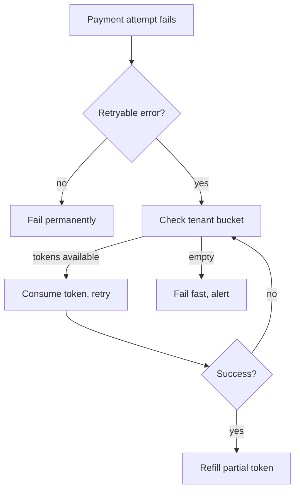
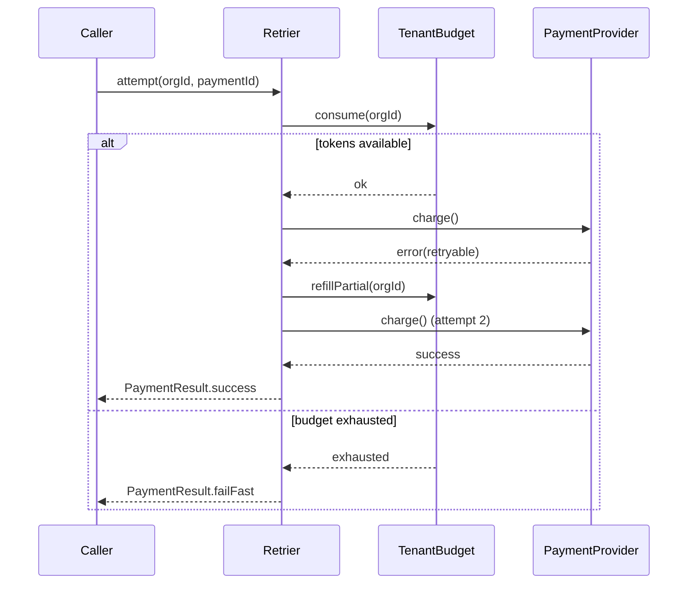
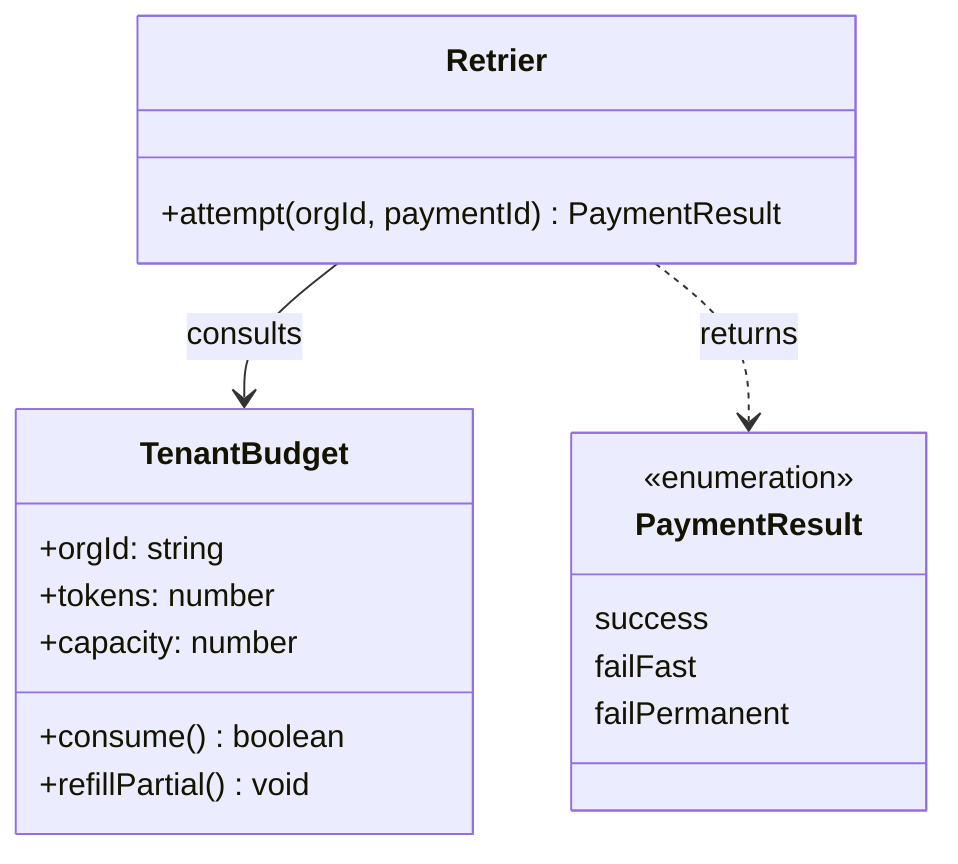

# Retry budget redesign

Payments currently retry with a fixed backoff. This doc proposes a **token-bucket
retry budget** per merchant, replacing the _global_ fixed-window limiter, and
covers rollout, risks, and open questions.

> [!NOTE]
> This is a design doc, not an implementation plan. See `PLAN.md` §4 for phasing.

> [!TIP]
> Skip to [Rollout](#rollout) if you already agree with the approach.

> [!IMPORTANT]
> Budget state must be tenant-scoped. A shared bucket across merchants is a
> cross-tenant leak, same class of bug as an unscoped query.

> [!WARNING]
> The old limiter's Redis keys (`retry:{merchant}`) are not compatible with the
> new schema. Migration must dual-write for one deploy cycle.

> [!CAUTION]
> Do not backport this to the legacy billing path — it does not have idempotency
> keys and will double-charge on retry.

A plain blockquote for comparison, no marker:

> "Simplicity is prerequisite for reliability." — Dijkstra

## Background

The current retrier:

- Retries **exactly twice** ~~or three times~~ (fixed off-by-one, fixed in #4021)
- Uses a _fixed_ 250ms → 500ms backoff, no jitter
- Is not tenant-aware — `Retrier.attempt(paymentId)` takes no `orgId`

### Why now

1. Merchant `acme-co` triggered a retry storm on 2026-06-30 that starved the
   queue for unrelated merchants.
2. The incident review (`INC-482`) called out the missing per-tenant isolation
   as the root cause, not the retry count itself.
3. Fixing isolation now avoids a second migration later.

## Design



Sequence for a single retry cycle, including the budget check:



Domain shape:



## Rollout

| Phase |                          Change                          |   Risk | Owner   |
| ----- | :------------------------------------------------------: | -----: | ------- |
| 1     | Dual-write budget state, old limiter still authoritative |    Low | `@dana` |
| 2     |    Flip read path to new budget, keep old as fallback    | Medium | `@dana` |
| 3     |             Remove old limiter + Redis keys              |    Low | `@sam`  |

- [x] Write `TenantBudget` domain type + tests
- [x] Dual-write migration behind flag
- [ ] Load test with simulated retry storm (`acme-co` replay)
- [ ] Remove legacy `retry:{merchant}` keys

## Config reference

Inline settings: `capacity=10`, `refillRate=0.5/s`, applied via
`configureBudget(orgId, opts)`.

```typescript
interface BudgetOptions {
  capacity: number;
  refillRate: number; // tokens per second
}

function configureBudget(orgId: string, opts: BudgetOptions): TenantBudget {
  return new TenantBudget(orgId, opts.capacity, opts.refillRate);
}
```

```sql
CREATE TABLE retry_budgets (
    org_id      uuid NOT NULL REFERENCES organizations(id),
    tokens      numeric NOT NULL DEFAULT 10,
    capacity    numeric NOT NULL DEFAULT 10,
    updated_at  timestamptz NOT NULL DEFAULT now(),
    PRIMARY KEY (org_id)
);
```

```bash
# replay the incident traffic against staging
./scripts/replay-incident.sh --incident INC-482 --target staging
```

---

## Language spread

Renderer must highlight all of these distinctly, not just TS/SQL/bash above.

```python
class TenantBudget:
    def __init__(self, org_id: str, capacity: float, refill_rate: float):
        self.org_id = org_id
        self.tokens = capacity
        self.capacity = capacity
        self.refill_rate = refill_rate

    def consume(self) -> bool:
        if self.tokens < 1:
            return False
        self.tokens -= 1
        return True
```

```rust
struct TenantBudget {
    org_id: String,
    tokens: f64,
    capacity: f64,
}

impl TenantBudget {
    fn consume(&mut self) -> bool {
        if self.tokens < 1.0 {
            return false;
        }
        self.tokens -= 1.0;
        true
    }
}
```

```yaml
retry_budget:
  capacity: 10
  refill_rate: 0.5
  scope: tenant
  fallback: legacy_limiter
```

```diff
- const RETRY_LIMIT = 2;
+ const RETRY_LIMIT = computeBudget(orgId).capacity;
```

## Status at a glance

- 🟢 Dual-write shipped, stable in staging for 4 days
- 🟡 Load test pending — `acme-co` replay not yet scheduled
- 🔴 Legacy limiter removal blocked on §Rollout phase 3

Badges for the doc header (rendered inline, not real CI):

`` `` ``

## Terminology

<dl>
  <dt>Token bucket</dt>
  <dd>Per-tenant counter that refills over time and is debited per retry attempt.</dd>
  <dt>Fixed-window limiter</dt>
  <dd>The outgoing global limiter, reset on a wall-clock boundary rather than continuously.</dd>
</dl>

Highlighted terms: ==budget exhaustion== triggers fail-fast; H<sub>2</sub>O is unrelated but exercises subscript; 2<sup>10</sup> exercises superscript. Press <kbd>Ctrl</kbd>+<kbd>Shift</kbd>+<kbd>P</kbd> to open the command palette in the review tool.

## Risk matrix

| Risk                                             | Likelihood | Impact | Mitigation                                 |
| ------------------------------------------------ | :--------: | :----: | ------------------------------------------ |
| 🔴 Dual-write drift between old/new limiter      |   Medium   |  High  | Shadow-compare counts nightly for 1 week   |
| 🟡 `refillPartial` race under concurrent retries |   Medium   | Medium | `SELECT ... FOR UPDATE` row lock           |
| 🟢 Redis key migration missed by a merchant      |    Low     | Medium | Keep both key formats readable for 1 cycle |

## Open questions

1. Should budget capacity scale with plan tier, same as `TierCeilings`?
2. Does `refillPartial` need to be async-safe under concurrent retries for the
   same `paymentId`? Current thinking: yes, guard with `SELECT ... FOR UPDATE`.

See also: [tier ceilings ADR](../docs/adr/0001-tiers.md), the
[incident review](https://example.com/incidents/INC-482) (external), and
footnote below for the jitter formula[^jitter].

[^jitter]: `delay = base * 2^attempt * (1 + random(-0.2, 0.2))`, capped at 8s.
