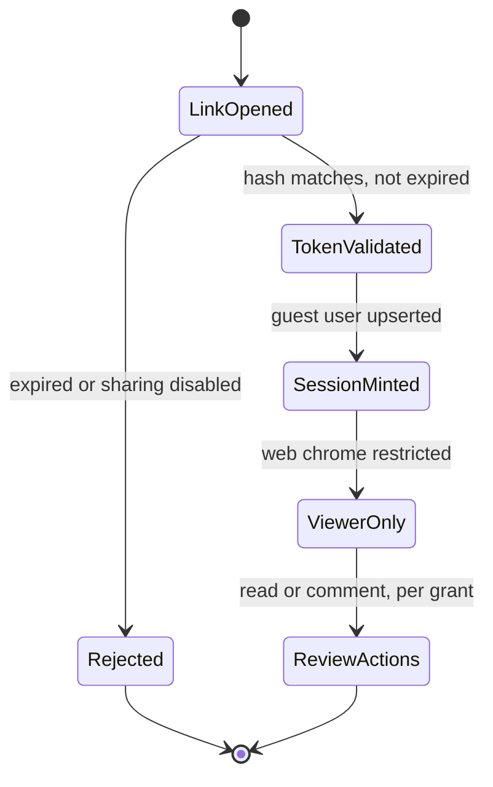

# New hire runbook: reviewing shared docs

Welcome. This runbook walks through what happens when someone outside the org
opens a document you shared with them, end to end.

> [!NOTE]
> Written for the _reviewer's_ perspective. If you're implementing the guest
> flow itself, this is not the doc for that.

## Table of contents

- [Sharing a document](#sharing-a-document)
- [What the guest sees](#what-the-guest-sees)
- [Expiry and re-share](#expiry-and-re-share)
- [Troubleshooting](#troubleshooting)

## Sharing a document

1. Open a document, click **Share externally**.
2. Enter the guest's email.
3. Pick expiry:
   - 7 days (default, all tiers)
   - 30 days (pro and up)
   - No expiry (enterprise, if `external_sharing` is on)
4. Confirm. A `share_grants` row is created with:
   1. `permission: 'read'` or `'comment'` — never `'edit'`
   2. a hashed single-use token
   3. `grantee_email` for the invite
5. Guest receives an email (currently logged, not sent — see note below).

> [!TIP]
> Re-sharing to the _same_ email before expiry just extends the window and
> reissues the token. No duplicate grant rows pile up.

> [!WARNING]
> If `organizations.external_sharing` is off, both create _and_ redeem are
> blocked — even for links minted before the flag was flipped off.

## What the guest sees

The guest identity is synthetic:

```
users row:
  role: 'guest'
  workos_user_id: 'guest:<uuid>'
```

Their session is capped the moment they redeem `/g/:token`:



Guests get **viewer-only** chrome — no document list, no org settings, no
navigation beyond the shared doc. The API also enforces this independently:
a preHandler (`blockGuestBeyondReview`) allowlists exactly the endpoints a
guest needs, so a frontend bug can't accidentally expose more surface.

Nested notes on how this interacts with seat counting:

- Guests do **not** count toward `TierCeilings.maxCollaborators`
  - Because seats model _members_, not _reviewers_
    - This mirrors how most review tools (Figma, Linear) treat commenters
  - There's a _separate_ ceiling: `maxExternalGuests` (3 / 25 / ∞ by tier)
- `maxGuestShareDays` is a clamp, never an error
  - Requesting 90 days on a free-tier org silently clamps to 7
  - This was a deliberate choice — see the thread below

## Expiry and re-share

Expiry is enforced **at read time**, not via a background sweep:

```typescript
function listForUser(grants: ShareGrant[], now: Date): ShareGrant[] {
  return grants.filter((g) => !g.expiresAt || g.expiresAt > now);
}
```

Same check happens in `byTokenHash` when a guest redeems a link — an expired
token 404s rather than 403s, so it doesn't leak "this link existed."

| Tier       | Max guests | Max share days |
| ---------- | ---------- | -------------- |
| Free       | 3          | 7              |
| Pro        | 25         | 30             |
| Enterprise | Unlimited  | Unlimited      |

## Config formats guests touch indirectly

Admins configure sharing defaults via one of these, all of which the renderer must color correctly:

```json
{
  "external_sharing": true,
  "maxGuestShareDays": { "free": 7, "pro": 30, "enterprise": null }
}
```

```yaml
external_sharing: true
tiers:
  free: { max_guests: 3, max_days: 7 }
  pro: { max_guests: 25, max_days: 30 }
  enterprise: { max_guests: null, max_days: null }
```

```graphql
type ShareGrant {
  id: ID!
  permission: SharePermission!
  granteeEmail: String
  expiresAt: DateTime
}

enum SharePermission {
  READ
  COMMENT
}
```

## Status legend

- 🟢 Shipped and stable: manual invite, SSO JIT, guest sharing
- 🟡 In progress: unread/watch dots (deferred, revisit on demand)
- 🔴 Blocked: SES delivery, waiting on Phase 10 AWS account

Badges: `` ``

## Glossary

<dl>
  <dt>Capability URL</dt>
  <dd>A link whose token itself grants access — no separate login step for the guest.</dd>
  <dt>Synthetic identity</dt>
  <dd>A <code>users</code> row created for a guest with no real WorkOS account behind it.</dd>
</dl>

Terms worth flagging: ==single-use token== means one redemption mints one session; retention window is capped at 7<sup>d</sup> for free tier. Reviewers can press <kbd>J</kbd> / <kbd>K</kbd> to move between comments and <kbd>E</kbd> to resolve.

## Guest limits by tier

| Tier          | Max guests | Max share days | External sharing default |
| ------------- | :--------: | :------------: | :----------------------: |
| 🟢 Free       |     3      |       7        |            On            |
| 🟡 Pro        |     25     |       30       |            On            |
| 🔴 Enterprise |     ∞      |       ∞        |     **Off** (opt-in)     |

## Troubleshooting

- **Guest says the link doesn't work**
  - Check `expires_at` on the grant — most common cause
  - Check `organizations.external_sharing` — enterprise defaults this _off_
- **Guest sees "permission denied" on a comment**
  - Grant `permission` is `'read'`, not `'comment'` — this is expected, not a bug
- **Invite email never arrived**
  - `EmailPort.sendOrgInvite` is currently `LoggingEmailAdapter` — it logs, it
    doesn't send. The token is also returned in the API response for now.
    Real delivery (SES) lands with Phase 10 infra.

---

Related reading: the [tenant isolation rules](../CONSTITUTION.md) (opaque IDs
only, no org data in logs — applies to guest emails too), and this external
writeup on [capability URLs](https://example.com/capability-urls) for context
on why the token is single-use rather than a long-lived secret.

Footnote on the token format[^token]:

[^token]:
    32 bytes from `crypto.randomBytes`, hashed with SHA-256 before
    storage — only the hash lives in `share_grants.token_hash`, matching how
    invite tokens work in Phase 15.
